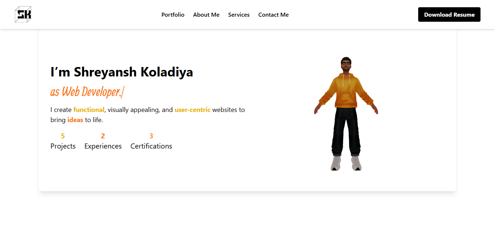

## 🚀 Shreyansh Koladiya - Portfolio

Welcome to my portfolio! This website showcases my work, skills, and projects as a **Web Developer/UX-UI Designer**.

## 🌐 Live Demo

[shreyanshkoladiya.com](https://shreyanshkoladiya.com)

## 📸 Screenshots



## ✨ Features

- 💻 Showcases my projects and skills
- 📱 Fully responsive design
- 🎨 Built with modern UI/UX practices
- 🌟 3D animations using Three.js

## 🛠 Tech Stack

- **Frontend:** React, Tailwind CSS, Three.js
- **Deployment:** Vercel / Netlify

## 📥 Installation & Setup

If you want to run this project locally, follow these steps:

```bash
# Clone the repository
git clone https://github.com/shreyu1701/web-portfolio.git

# Navigate to the project folder
cd web-portfolio

# Install dependencies
npm install

# Start the development server
npm run dev
```

## 📩 Contact

Feel free to reach out!

- 📧 Email: [shreyanshkoladiyawork@gmail.com](mailto:shreyanshkoladiyawork@gmail.com)
- 🔗 LinkedIn: [www.linkedin.com/in/shreyansh-koladiya-38a2b71a3](https://www.linkedin.com/in/shreyansh-koladiya-38a2b71a3/)

### Made with ❤️ and alot of debugging by **Shreyansh Koladiya**
